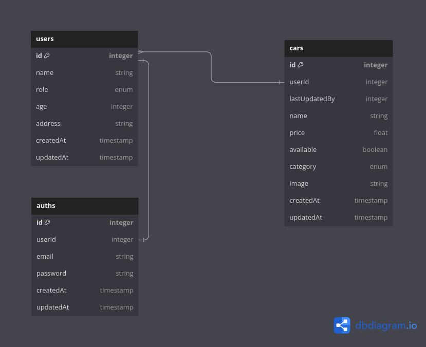

## Table of Contents

- [Database Diagram](#database-diagram)
- [Quick Start](#quick-start)
  - [Installation](#installation)
  - [Configuration](#configuration)
  - [Sequelize Migration](#sequelize-migration)
- [API Documentation](#api-documentation)
- [Fixing Error](#fixing-error)

## Database Diagram



## Quick Start

## Installation

```sh
git clone https://github.com/homurin/binar-challenge-05.git
npm install
npm run dev
```

## Configuration

You got error when run

```sh
npm run dev
// or
npm run start
```

You need to configure environment on `.env` file.
Copy `.env.example` file and name it `.env` or run this simple command on your terminal.

```sh
cp .env.example .env
```

Finally fill necessary environment variables to configure server and database. Then you can run the application

```sh
# server configuration

PORT=

#  database configuration

DATABASE_USERNAME=
DATABASE_NAME=
DATABASE_PASSWORD=
DATABASE_HOST=
DATABASE_PORT=

#  bcrypt configuration

SALT_ROUNDS=

#  jwt configuration

JWT_SECRET=

# imagekit configuration

IMAGEKIT_PUBLIC_KEY=
IMAGEKIT_PRIVATE_KEY=
IMAGEKIT_URL_ENDPOINT=

```

## Sequelize Migration

After download all dependencis and configure .env file, Last step is do postgresql migration with simply run this command.

```sh
# note : using npx sequelize instead when you not download globaly sequelize-cli on your local machine

sequelize db:create
sequelize db:migrate
sequelize db:migrate:all
```

## API Documentations

You can read full Swagger API Documentation on `http://base_url:port/api-docs`

## Fixing Error

If you using linux and got database failed to connect then you can check postgresql server status.

```sh
systemctl status postgresql
```

If the postgresql server is inactive then start the service

```sh
sudo systemctl start postgresql
```
